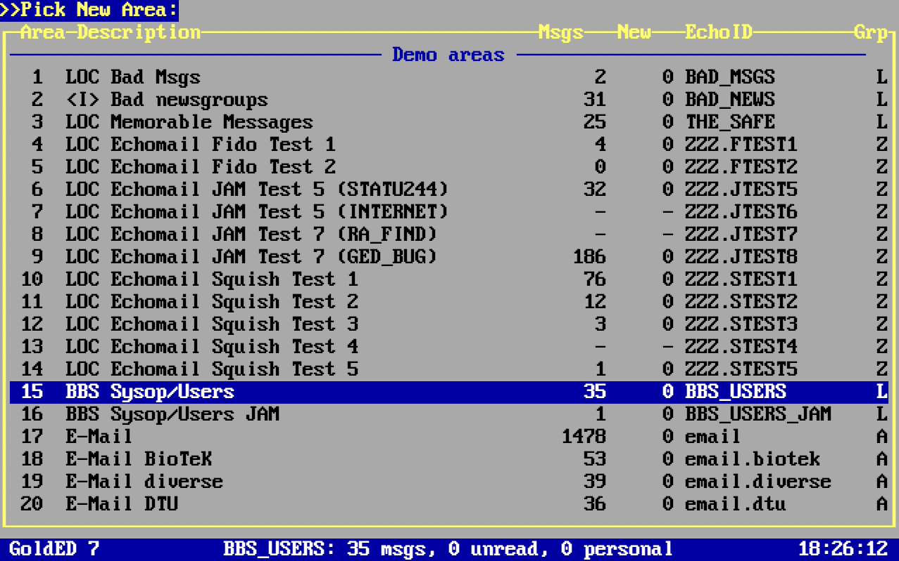
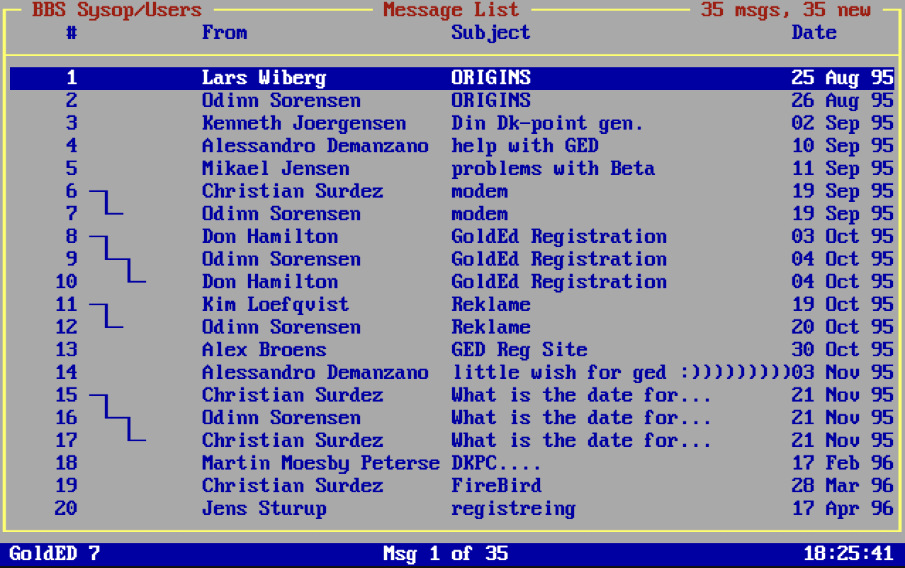
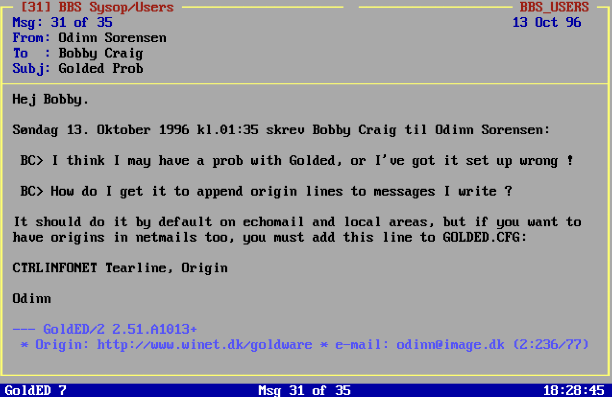
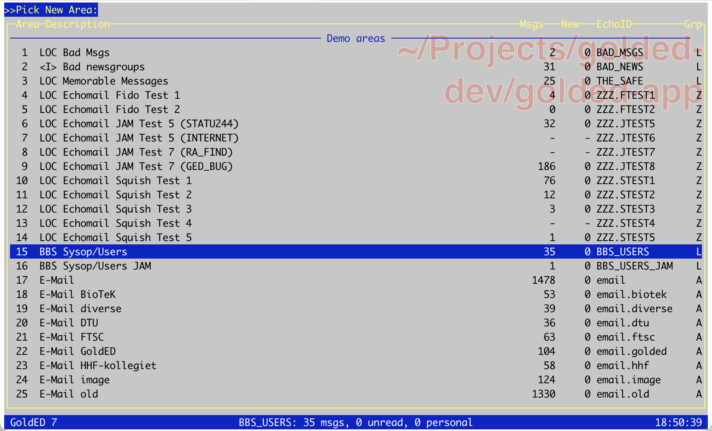
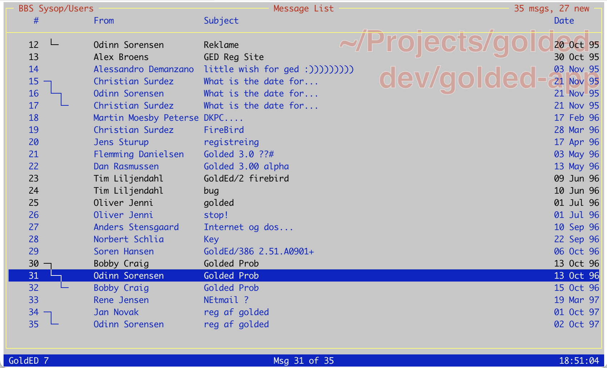
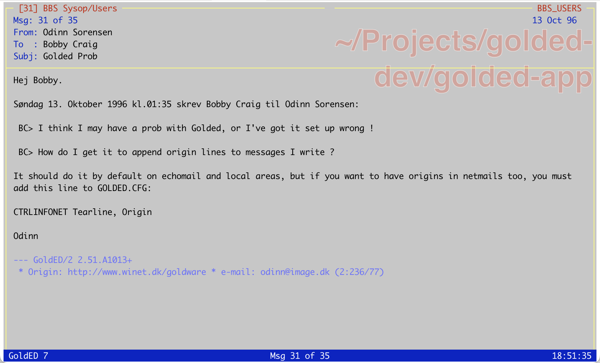

# GoldED 7

GoldED 7 is a browser and terminal remake of GoldED, the FTN mail reader and editor I wrote in the 90s.

It reads old message bases, imports them into Laravel, and lets you move around them without needing the rest of the old BBS machinery. The original was DOS-era muscle memory. This one is PHP, Livewire, and a small refusal to let useful old tools vanish quietly.

## Status

Sharp beta.

GoldED 7 reads and navigates imported message bases today. FidoNet sending is out of scope for `7.0.0`. This release is about getting the reader, importer, sample data, and development setup into public shape.

## Screenshots

### Browser





### Terminal





## Why 7?

The old public line ended at GoldED `3.0.1`. There was also an unshipped GoldED 4.

So this is GoldED 7: 3 + 4, with a small amount of numerology and no apology. Also, I like the number 7.

## Quick Start

```bash
composer install
cp .env.example .env
php artisan key:generate
touch database/database.sqlite
php artisan migrate
npm install
npm run build
php artisan golded:import msg samples/msg --fresh
php artisan golded:run
```

That imports the tiny synthetic `.MSG` sample in `samples/msg/DEMO/1.msg`.

## Browser

Open `/` to use the GoldED shell in the browser.

The app is a Laravel application, so use whatever local setup you prefer. Laravel Herd works well. SQLite is the default because public onboarding should not start with database theatre.

## Importing Message Bases

Import a message base directly:

```bash
php artisan golded:import msg samples/msg --fresh
php artisan golded:import jam /path/to/jam/root
php artisan golded:import squish /path/to/squish/root
php artisan golded:import hudson /path/to/hudson/root
```

Parse a GoldED config file:

```bash
php artisan golded:config /path/to/GOLDED.CFG
```

Import areas from `config/golded.php`:

```bash
php artisan golded:import-config --root=/path/to/message/root
```

The checked-in config is a safe demo config. Point it at your own archive when you are ready.

## Supported Formats

GoldED 7 can import:

- `.MSG`
- JAM
- Squish
- Hudson

The `7.0.0` release ships with a synthetic `.MSG` sample. Public JAM, Squish, and Hudson sample message bases can wait. Their importers are still tested with public fixtures, because old private archives do not belong in a public repo. Shocking, I know.

## Databases

Supported databases:

- SQLite for local setup and tests
- MySQL for local or production use

PostgreSQL is not claimed here. It may work later. Today it is not part of the contract.

## Development

Useful checks:

```bash
composer validate --strict
npm run build
composer lint:check
composer test:types
composer test:refactor
php artisan test --compact
```

Format PHP before committing:

```bash
vendor/bin/pint --dirty --format agent
```

## Versioning

GoldED 7 uses Git tags for releases. The first public release is `v7.0.0`.

Do not add a Composer `version` field. That way lies stale metadata and small domestic tragedy.

## Contributing

Keep changes narrow. Add or update tests when behavior changes. Prefer readable code over clever code with a hat.

See `CONTRIBUTING.md`.

## Security

Please do not file public issues for security reports. Use GitHub Security Advisories:

<https://github.com/golded-dev/golded-app/security/advisories/new>

See `SECURITY.md`.

## License

MIT. See `LICENSE`.
